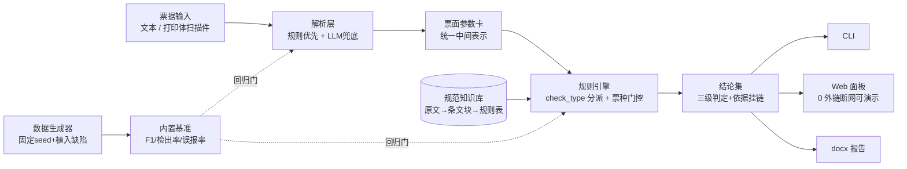

# power-operation-ticket-checker

电力"两票"（工作票/操作票）智能审核与合规校核系统 —— **规则优先 · 依据挂链 · 基准可复现**。

> 状态：🚧 **M5 完成（编排与交付：CLI run 批量 + docx 报告 + Web 面板，2026-10-02）**。7 票种全部解析为参数卡并经 35 份带真值样例全集精确对账；39 条规则全 7 类 check_type、依据挂链知识库三层；基准 F1 1.0 / 误报 0；报告无外链、Web 页面 0 外链断网可演示。

## 这是什么

"两票三制"是电力安全生产的核心制度。本系统对工作票与倒闸操作票做**自动解析 + 形式/内涵合规校核 + 依据关联与整改建议**：

- **票面参数卡**：统一中间表示（字段-值-置信度-证据{票面区域,原文摘录}）；
- **三级结论**：合规 / 不合规（低·一般·较大·重大）/ 待人工确认，每条结论强制挂规范出处（标准号+条号+status）；
- **结论纪律**：数值与条文结论只来自确定性规则，LLM 仅做兜底抽取与行文（M4），无出处的规则不得落库。

## 架构



## 快速开始

要求：Python ≥ 3.8，无第三方依赖。

```bash
# Windows（开发环境实测）
py -X utf8 -m powerticket demo          # 内置样例端到端：解析 → 校核 → 控制台报告
py -X utf8 -m powerticket check data/samples/sample-operating-01.txt   # 参数卡+结论 JSON
py -X utf8 -m powerticket run data/samples/gen          # 目录批量审核：逐票结论+批量汇总
py -X utf8 -m powerticket run <票据或目录> --report <docx路径/目录>      # 审核同时导出 docx 报告
py -X utf8 -m powerticket report <票据>.txt             # 单票 docx 审核报告（需 .[report]）
py -X utf8 -m powerticket web                           # Web 审核面板 http://127.0.0.1:8000（需 .[web]）
py -X utf8 -m powerticket benchmark     # 内置基准：解析 F1 / 检出率 / 误报率（零 API 依赖）
py -X utf8 -m pytest                    # 测试（205 项，全离线）

# 重新生成内置带真值评测集（固定 seed 位级一致，详见 data/generator/README.md）
py -X utf8 data/generator/generate.py --force

# Linux / macOS
python3 -X utf8 -m powerticket demo

# 可选：安装为命令行工具 + 开发依赖
py -m pip install -U pip    # Python 3.8 自带的旧 pip 不支持 pyproject-only 可编辑安装，先升级
py -m pip install -e ".[dev]"
powerticket --help
```

当前实现范围：**7 票种全部解析**（操作票含发令人与操作序列，工作票含计划时间双拆/许可/终结/签发/许可人与安全措施条目，抢修单含许可人与安全措施条目）+ **39 条正式规则全 7 类 check_type**（required_field / time_order / process_signature / ticket_type_match / measure_coverage / five_prevention / consistency，依据挂链知识库三层：官方 PDF/登记卡 → 条文块 → 规则库）+ **内置基准**（35 份带真值样例，字段级 F1 与端到端检出/误报，零 API 可复现）+ **LLM 兜底抽取**（可选，DashScope qwen，断供自动降级纯规则通路）+ **编排与交付**（目录批量审核、docx 审核报告、Web 面板）。

## 路线图

| 里程碑 | 内容 | 状态 |
|---|---|---|
| M0 | 计划文档（plan/00–06）+ 可运行骨架 | ✅ |
| M1 | 数据先行：生成器（固定 seed/植入缺陷/真值）+ 7 票种模板 + 35 份配对评测集 | ✅ |
| M2 | 解析层：7 票种 → 参数卡，回归测试 | ✅ |
| M3 | 规范知识库三层 + 规则引擎全量（类目门控、依据关联） | ✅ |
| M4 | LLM 兜底（防幻觉三件套）+ 内置基准 | ✅ |
| M5 | CLI run + docx 报告 + Web 面板（0 外链） | ✅ |
| M6 | 干净环境验证 + 脱敏发布 GitHub | ⬜ |

## 内置基准（M4 达成）

设计门槛：票面解析字段级 **F1 ≥ 0.95**、植入缺陷检出最大化且**误报 0**、基准**零 API 依赖**可重复。实测（`data/samples/gen` 35 份带真值样例，seed=20261002，2026-10-02）：

| 指标 | 结果 |
|---|---|
| 解析字段级 P / R / F1 | 1.0 / 1.0 / **1.0**（463 个评测项：0 误报 0 漏报） |
| 缺陷检出率 | **1.0**（28/28 缺陷样例，非 pass 集合 == expect∪also_expect 精确对账） |
| 误报率 | **0**（7 份正常样例零非 pass 结论，28 份缺陷样例零多出结论） |
| 判定准确率 | **1.0**（35/35） |

运行方式（零 API 依赖，固定 seed 数据集位级可复现；门槛未过退出码 1）：

```bash
py -X utf8 -m powerticket benchmark             # 人读报表 + 门槛判定
py -X utf8 -m powerticket benchmark --json      # 机器可读 JSON
py -X utf8 -m powerticket.eval.parse_f1         # 单跑解析 F1
py -X utf8 -m powerticket.eval.endtoend         # 单跑端到端检出/误报
```

口径（M4 定稿，与 tests/test_data_generator.py 一致）：字段级按 `truth.fields` 逐键对账（remarks 是唯一不入真值的已抽取字段，不计分），操作序列/安全措施按位对账；端到端按 M3 全集精确对账——非 pass 结论的 check_type 集合 == expect∪also_expect。脚本接口：`powerticket.eval.parse_f1.run(samples_dir=None)`、`powerticket.eval.endtoend.run(samples_dir=None, rules_path=None)`。

## LLM 兜底抽取（M4，可选）

纪律：**数值结论永远来自确定性规则**。LLM 仅在规则解析失败或字段低置信度时兜底抽取，与规则解析同一参数卡出口（TicketCard），全链路 warnings 留痕：

- **缺失字段不兜底**：字段缺失本身是合规信号（required_field 判定），兜底填充会掩盖缺陷；
- **摘录逐字回验**：LLM 字段/条目必须携带原文逐字摘录，否则该项不入卡（防幻觉）；
- **断供降级**：未装依赖 / 未配密钥 / 网络断 / 坏响应一律降级纯规则通路，行为与不开启兜底完全一致（测试锁定）。

启用（供应商：DashScope qwen，openai 兼容模式，`enable_thinking=false`，决策 D-2；依赖仅入 extras）：

```bash
py -m pip install -e ".[llm]"
echo DASHSCOPE_API_KEY=sk-xxx > .env        # 密钥不入仓（.gitignore 已排除）
py -X utf8 -m powerticket check <票据>.txt --llm-fallback
```

模型/接入点/超时可用环境变量覆盖：`POWERTICKET_LLM_MODEL`（默认 qwen-plus）、`POWERTICKET_LLM_BASE_URL`、`POWERTICKET_LLM_TIMEOUT`（默认 30 秒）。

## 编排与交付（M5 达成）

**目录批量审核**（core 零依赖，处理失败不中断整批，存在失败退出码 1）：

```bash
py -X utf8 -m powerticket run data/samples/gen            # 35 份样例逐票结论 + 批量汇总
py -X utf8 -m powerticket run data/samples/gen --json     # 机器可读（含逐票完整结果与 aggregate）
py -X utf8 -m powerticket run data/samples/gen --report reports/   # 每票一份 docx 落报告目录
```

**docx 审核报告**（extras[report]，`pip install -e ".[report]"`）：章节为元信息 → 一、结论汇总 → 二、分级问题清单（按重大/较大/一般/低风险）→ 三、逐条证据（含原文摘录，取参数卡证据链逐字）→ 四、整改建议 → 五、待人工确认（独立成节）→ 六、签署栏。**报告无外链**：不写 URL/超链接，判据 `powerticket.report.find_external_links`（超链接元素 / External 关系 / 正文 http(s)://）测试锁定。

**Web 审核面板**（extras[web]，`pip install -e ".[web]"`）：上传 → 参数卡 → 校核结论 → 报告预览与 docx 导出（预览与 docx 共用同一章节结构，预览即所得）。前端为零依赖内联单页，**页面 0 外链**断网可演示（无任何外部资源引用，/docs、/redoc 已关闭）：

```bash
py -X utf8 -m powerticket web              # http://127.0.0.1:8000（--host/--port 可改）
```

## 依赖分层

| 安装 | 用途 |
|---|---|
| `pip install .` | core（解析/规则/CLI），零第三方依赖 |
| `.[web]` | Web 面板（fastapi/uvicorn/python-multipart） |
| `.[report]` | docx 报告（python-docx） |
| `.[llm]` | LLM 兜底（openai 兼容接口） |
| `.[dev]` | 开发测试（pytest、httpx——TestClient 冒烟） |

## 目录结构

```
├── powerticket/       # 包：cli / models / parse / rules / knowledge / llm / pipeline / report / web / eval
├── data/              # 台账 + 样例 + 票样模板 + 生成器 + 知识库（raw/chunks/rules）
├── tests/             # pytest 全离线
├── plan/              # 计划文档 00–06 + 交接快照 HANDOFF
├── scripts/           # 发布审计脚本（M6）
└── .github/workflows/ # CI（ubuntu 3.9/3.11/3.13 + 3.8 + windows）
```

## 限制与免责声明

- 全部数据为**程序自制/人工编写的虚构演示数据**，设备名、人名、单位名均非真实；
- 规则依据条款入库时挂 `status` 字段，`待核对` 条目不参与确定性结论（显式标注）；
- 本项目是教学/研究用途的自动化辅助工具，**不替代人工审核**，不构成安全生产决策依据；
- 规范原文版权归发布方所有，本仓库仅保存字段结构重构与出处链接，不转载全文。

## 开发文档

计划全量在 [plan/](plan/00-README总览.md)：[02-需求解读](plan/02-需求解读.md) · [03-架构与技术选型](plan/03-架构与技术选型.md) · [04-模块详设](plan/04-模块详设.md) · [05-数据计划与里程碑](plan/05-数据计划与里程碑.md) · [06-决策记录](plan/06-决策记录.md)。

## License

[MIT](LICENSE)
