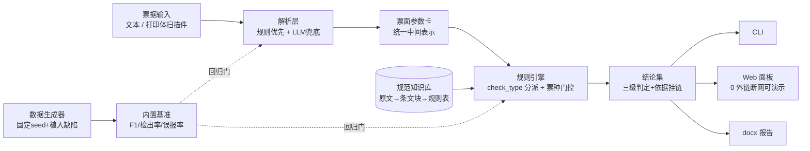

# power-operation-ticket-checker

电力"两票"（工作票/操作票）智能审核与合规校核系统 —— **规则优先 · 依据挂链 · 基准可复现**。

> 状态：🚧 **骨架阶段（v0.1.0，M0）**。计划文档齐全（[plan/](plan/00-README总览.md)），端到端骨架可运行；7 票种解析、规则库、基准、报告/Web 按里程碑推进。

## 这是什么

"两票三制"是电力安全生产的核心制度。本系统对工作票与倒闸操作票做**自动解析 + 形式/内涵合规校核 + 依据关联与整改建议**：

- **票面参数卡**：统一中间表示（字段-值-置信度-证据{票面区域,原文摘录}）；
- **三级结论**：合规 / 不合规（低·一般·较大·重大）/ 待人工确认，每条结论强制挂规范出处（标准号+条号+status）；
- **结论纪律**：数值与条文结论只来自确定性规则，LLM 仅做兜底抽取与行文（M4），无出处的规则不得落库。

## 架构



## 快速开始（当前骨架能力）

要求：Python ≥ 3.8，无第三方依赖。

```bash
# Windows（开发环境实测）
py -X utf8 -m powerticket demo          # 内置样例端到端：解析 → 校核 → 控制台报告
py -X utf8 -m powerticket check data/samples/sample-operating-01.txt   # 参数卡+结论 JSON
py -X utf8 -m pytest                    # 测试（24 项，全离线）

# Linux / macOS
python3 -X utf8 -m powerticket demo

# 可选：安装为命令行工具 + 开发依赖
py -m pip install -e ".[dev]"
powerticket --help
```

当前骨架实现范围：变电站倒闸操作票 demo 解析 + 2 条演示规则（必填项/时间顺序）+ 类目门控引擎通路。`report`/`web`/`benchmark` 子命令已就位，调用时提示计划里程碑（M5/M4）。

## 路线图

| 里程碑 | 内容 | 状态 |
|---|---|---|
| M0 | 计划文档（plan/00–06）+ 可运行骨架 | ✅ |
| M1 | 数据先行：生成器（固定 seed/植入缺陷/真值）+ 7 票种模板 | ⬜ |
| M2 | 解析层：7 票种 → 参数卡，回归测试 | ⬜ |
| M3 | 规范知识库三层 + 规则引擎全量（类目门控、依据关联） | ⬜ |
| M4 | LLM 兜底（防幻觉三件套）+ 内置基准 | ⬜ |
| M5 | CLI run + docx 报告 + Web 面板（0 外链） | ⬜ |
| M6 | 干净环境验证 + 脱敏发布 GitHub | ⬜ |

## 内置基准（M4 提供）

设计门槛：票面解析字段级 **F1 ≥ 0.95**、植入缺陷检出最大化且**误报 0**、基准**零 API 依赖**可重复。指标达成后回填：

| 指标 | 结果 |
|---|---|
| 解析 F1 | 未达成（M4） |
| 端到端检出率 / 误报率 | 未达成（M4） |

## 依赖分层

| 安装 | 用途 |
|---|---|
| `pip install .` | core（解析/规则/CLI），零第三方依赖 |
| `.[web]` | Web 面板（fastapi/uvicorn/python-multipart） |
| `.[report]` | docx 报告（python-docx） |
| `.[llm]` | LLM 兜底（openai 兼容接口） |
| `.[dev]` | 开发测试（pytest） |

## 目录结构

```
├── powerticket/       # 包：cli / models / parse / rules / knowledge / llm / pipeline / report / web / eval
├── data/              # 台账 + 样例 + 票样模板 + 生成器 + 知识库（raw/chunks/rules）
├── tests/             # pytest 全离线
├── plan/              # 计划文档 00–06 + 交接快照 HANDOFF
├── scripts/           # 发布审计脚本（M6）
└── .github/workflows/ # CI（ubuntu 3.9/3.11/3.13 + 3.8 + windows）
```

## 限制与免责声明

- 全部数据为**程序自制/人工编写的虚构演示数据**，设备名、人名、单位名均非真实；
- 规则依据条款入库时挂 `status` 字段，`待核对` 条目不参与确定性结论（显式标注）；
- 本项目是教学/研究用途的自动化辅助工具，**不替代人工审核**，不构成安全生产决策依据；
- 规范原文版权归发布方所有，本仓库仅保存字段结构重构与出处链接，不转载全文。

## 开发文档

计划全量在 [plan/](plan/00-README总览.md)：[02-需求解读](plan/02-需求解读.md) · [03-架构与技术选型](plan/03-架构与技术选型.md) · [04-模块详设](plan/04-模块详设.md) · [05-数据计划与里程碑](plan/05-数据计划与里程碑.md) · [06-决策记录](plan/06-决策记录.md)。

## License

[MIT](LICENSE)
