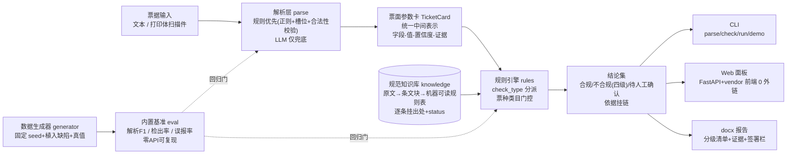

# 03 架构与技术选型

> 决策状态：本文档为 M0 定稿初稿；重大变更须登记 [06-决策记录.md](06-决策记录.md)。

## 1. 总体架构



核心思想：**两侧归约为结构化对齐**——票据解析成参数卡，规范解析成规则表，"审核"就是参数卡 × 规则表的可追溯运算；LLM 不进入结论通路。

## 2. 技术选型

| 维度 | 选择 | 备选 | 理由 |
|---|---|---|---|
| 语言 | Python ≥3.8（本机实测 3.8.8） | Node.js | python-docx/FastAPI 生态顺；姊妹项目方法论 Python 经验可复用；本机即 3.8 |
| CLI | argparse（stdlib） | typer/click | core 零三方依赖 |
| 解析 | 正则+槽位+合法性校验，LLM 兜底 | 纯 LLM / 重 OCR | 数值结论必须确定性；防幻觉 |
| 规则引擎 | 自研 JSON 规则 + check_type 分派 | 决策引擎框架 | 轻量可控，依据字段强制化 |
| 知识检索 | 纯 Python 余弦向量（小规模） | faiss/sklearn | 规模小，少依赖 |
| LLM 客户端 | openai 兼容接口（base_url 可指 DashScope 等），`enable_thinking=false` | dashscope SDK 原生 | 供应商可换，接口统一 |
| Web | FastAPI + uvicorn + python-multipart（extra）；前端 Vue3/PDF.js vendor 本地化 | Flask/Django | 免构建、0 外链断网演示 |
| 报告 | python-docx（extra） | pandoc | 纯 Python，可控格式 |
| 测试 | pytest + 离线 mock | unittest | 生态标准 |
| CI | GitHub Actions 矩阵 | — | ubuntu 3.9/3.11/3.13 + ubuntu-22.04 3.8 + windows 3.11 |

## 3. 依赖分层（extras）

| 分组 | 依赖 | 何时需要 |
|---|---|---|
| core（默认） | 无三方依赖 | 解析/规则/CLI 全部可用 |
| `[web]` | fastapi, uvicorn, python-multipart | Web 面板（注意：`UploadFile=File(...)` 隐式依赖 python-multipart，漏声明启动即崩——已在依赖表锁死） |
| `[report]` | python-docx | docx 导出 |
| `[llm]` | openai | LLM 兜底（M4） |
| `[dev]` | pytest | 开发/CI |

纪律：**extras 必须覆盖运行期真实 import**；新增依赖先进 extras 并配回归测试；CLI 对缺失依赖打印安装提示后降级（exit 0/2），不得裸 traceback。

## 4. LLM 兜底与防幻觉（M4 落地）

- LLM 职责白名单：非结构化抽取兜底、别名归一、复核、报告行文。**数值结论永远来自确定性规则。**
- 防幻觉三件套：①候选行压缩（只送含数字/关键词的行控成本）；②要求输出"原文编号+逐字摘录"，摘录不是原文子串即丢弃；③数值合法性范围校验。
- 客户端配置：`enable_thinking=false`、max_tokens 截断的 JSON 修复、重试+超时、失败降级规则通路。
- 待拍板：LLM 供应商（默认 DashScope qwen，openai 兼容模式接入），见 06 决策表。

## 5. 目录布局（flat 布局，源码即运行）

```
power-operation-ticket-checker/
├── powerticket/          # 包（flat 布局：repo 根即可 py -m powerticket）
│   ├── cli.py            # argparse 子命令：demo/parse/check/run/report/web/benchmark
│   ├── models/           # TicketCard / FieldValue / Evidence / Conclusion
│   ├── parse/            # 票种路由 + 各票种解析器 + 清洗（CRLF/伪空格）
│   ├── rules/            # 引擎（check_type 分派 + 票种门控）+ checks 实现
│   ├── knowledge/        # 三层知识库加载（M3）
│   ├── llm/              # LLM 兜底客户端（M4，lazy import）
│   ├── pipeline/         # 解析→校核→汇总 编排
│   ├── report/           # docx 导出（M5，lazy import）
│   ├── web/              # FastAPI 应用（M5，lazy import）
│   └── eval/             # 基准脚本（M4）
├── data/                 # 四类数据+台账（见 plan/05）
├── tests/                # pytest（全离线）
├── plan/                 # 本计划文档 + HANDOFF
├── scripts/              # 脱敏审查等发布脚本（M6）
└── .github/workflows/    # CI
```

## 6. 关键工程纪律（继承方法论，开发期全程有效）

1. 解析层必防：CRLF 残留、字符定位伪空格、多行标注聚类、中文路径、GBK 控制台（`py -X utf8`）。
2. 规则引擎**类目门控**（applies_to 票种门控）对**全部** check_type 生效，防跨票种误查。
3. 基准零 API；指标门槛 F1≥0.95、误报 0，动数据/接口后必须重跑不回退。
4. 知识条目无出处（status=待核对）不得以确定语气进结论。
5. 显示层不可信：文档/数据修改用断言计数替换或整文件重写；验证以退出码+落盘+git status 为准。
